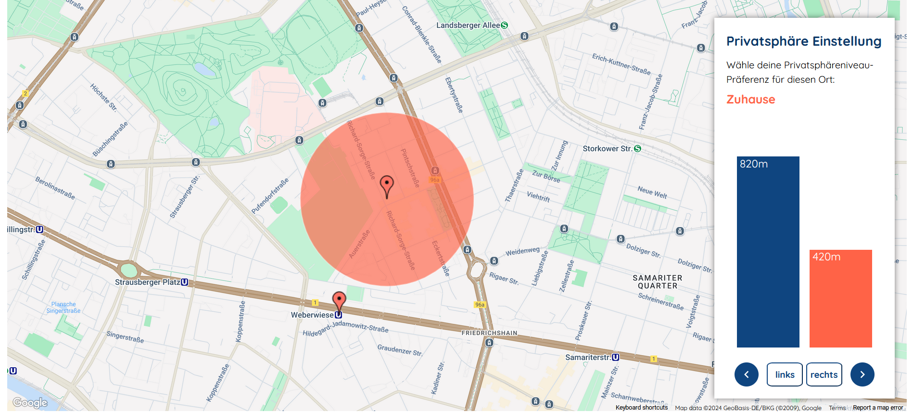

# Optimizing User Experience through Iterative Feedback

Accompanying repository for my bachelor thesis.

## Overview

The bachelor thesis "Optimizing User Experience through Iterative Feedback: Usability Testing and Interface Design" was written as part of my studies at Freie Universität Berlin. The goal of this study was to enhance a previously implemented interface through an iterative design approach. The interface incorporates Human-in-the-Loop Bayesian Optimization within the framework of Differential Privacy, situating it in a time-relevant field of study.

The original interface was implemented by Fabrizio Kuruc as part of his master's thesis [GitHub Repository](https://github.com/fabriz-io/universal-preference-exploration) and served as the foundation for this work.
The focus of my research was on refining user interaction, enhancing interface accessibility, and addressing key usability issues identified through two rounds of user testing.

Here is a preview of the interaction design:


## Project structure:

- ```/src```: contains the main source code for the updated interface.
- ```/src/pages```: explanatory pages
- ```/backend```: contains the backend that was adopted from [GitHub Repository](https://github.com/fabriz-io/universal-preference-exploration).


## Installation and Setup

#### Prerequisites:
- Node.js installed
- Docker Desktop installed for Windows
- Python 3.9
- Create a Google Maps API key. It can be done here:[https://developers.google.com/maps/documentation/javascript/get-api-key] 

1. Clone the repository:

``` git clone https://github.com/your-repo-url ```

2. Install dependencies:

``` npm install ```

3. Add APIKEY from Google Maps place this key in a file called ```.env``` within ```/backend```. 

```APIKEY="your_api_key"```
 
4. Run the project locally:
 
``` npm run start```

Now that you have the frontend running you need set up the backend: 

5. Build and run a docker image by firstly navigating into the ``` interaction_design/backend``` folder.

``` cd backend```
``` docker-compose up --build```
 
(Note: this Dockerfile is just for testing purposes and only runs on localhost)


- ```-d```: Runs the container in detached mode (in the background).
- ```p 5000:5000```: Maps port 5000 of the host to port 5000 of the container.
- ```--name my_container```: Names the container my_container.
- ``` my_backend```:the name of the Docker image that was build in step 4

### Reaching the interfaces
- Main interaction design (design iteration 1): http://localhost:3000/
- Last updated version of the interaction design (design iteration 2): http://localhost:3000/version_2
- Explanation of testing scenario: http://localhost:3000/pages/s1
- Explanation of DP and scenario: http://localhost:3000/pages/s2
